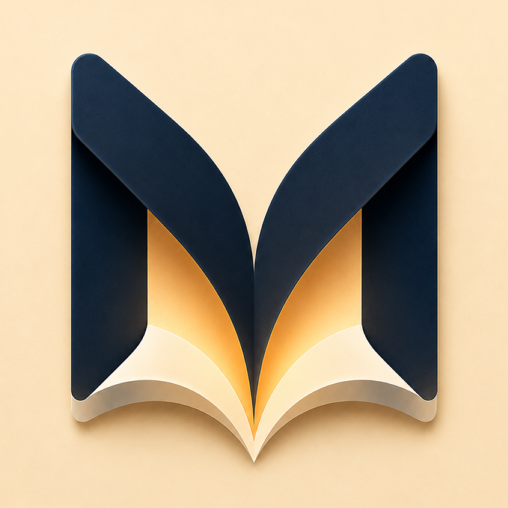

  

<h1 align="center">Morrow</h1>

<strong>Every story has a Morrow.</strong>

Morrow is a native iPhone and iPad audiobook player for people who keep their libraries on their own <a href="docs/bookorbit-setup.md">BookOrbit</a> or <a href="docs/audiobookshelf-setup.md">Audiobookshelf</a> servers.

  <a href="docs/getting-started.md">Get Started</a> ·
  <a href="docs/faq.md">FAQ</a> ·
  <a href="docs/troubleshooting.md">Troubleshooting</a> ·
  <a href="https://github.com/LiftbridgeLabs/Morrow-Docs/issues">Support</a>

---

## The name

A **morrow** is what comes next: the following day, tomorrow, the continuation after today.

Morrow is not named simply because it plays audiobooks. It is named because it protects what comes next. Stop listening today and Morrow remembers where you were. Change devices or move between supported libraries and your story can continue without starting over.

> **Every story has a Morrow.**  
> Because every story deserves to continue.

Morrow is built around continuity — carrying stories forward across days, devices, and the places your books live.

## Why Morrow

- **All your servers, one app** — connect multiple BookOrbit and Audiobookshelf servers at once, and keep the listening position of a book in sync when it lives on more than one of them.
- **One Listening shelf** — everything you have in progress, combined across every server, on a single tab.
- **Listen offline, start instantly** — download books to keep, and let the automatic playback cache save what you're streaming so the next start or seek is instant. Nothing touches cellular data unless you allow it.
- **A player built for audiobooks** — chapters, playback speed, a sleep timer that can stop at the end of the chapter, lock-screen and background playback.
- **Set up once, everywhere** — your server configuration can back up to iCloud Keychain and restore on a new device in one tap.
- **CarPlay** — built and ready, arriving with an upcoming release.

Screenshots are coming as the interface settles.

## Status

| | |
|---|---|
| Development | Active — private development builds |
| TestFlight | Not yet available |
| App Store | Not yet released |
| CarPlay | Implemented; Apple entitlement approval pending |
| Requires | iOS 18 / iPadOS 18 or later |

## Documentation

- [Getting started](docs/getting-started.md)
- [BookOrbit setup](docs/bookorbit-setup.md)
- [Audiobookshelf setup](docs/audiobookshelf-setup.md)
- [Frequently asked questions](docs/faq.md)
- [Troubleshooting](docs/troubleshooting.md)

## Support and feedback

- [Report a bug](https://github.com/LiftbridgeLabs/Morrow-Docs/issues/new?template=bug-report.yml)
- [Request a feature](https://github.com/LiftbridgeLabs/Morrow-Docs/issues/new?template=feature-request.yml)
- [Ask for help](https://github.com/LiftbridgeLabs/Morrow-Docs/issues/new?template=support-request.yml)

Before opening a new issue, please search the existing issues to see whether the same topic has already been reported.

## Project information

- [Release notes](CHANGELOG.md)
- [Privacy](PRIVACY.md)
- [Support policy](SUPPORT.md)
- [Security](SECURITY.md)

## Support development

Morrow is developed independently by [Liftbridge Labs](https://github.com/LiftbridgeLabs). Voluntary support helps fund continued development, testing, and maintenance.

---

Morrow is a commercial, closed-source application. This public repository contains documentation and issue tracking only. Morrow does not provide, sell, or host audiobook content — it plays libraries from servers you operate.
